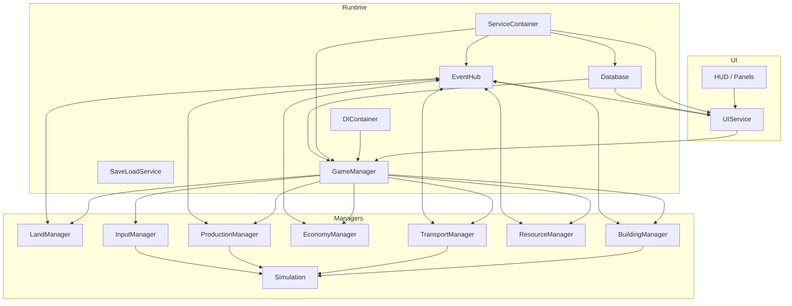

# IndustrieLite – Architektur

## Projektstruktur

```
.
├── .github/                  # GitHub workflows & templates (CI/CD, Issue-Templates)
├── assets/                   # Game assets (buildings, tiles, resources, vehicles, etc.)
├── code/                     # C#-Quellcode (neu organisiert)
│   ├── buildings/            # Gebäude & Services (Factory, Registry, Placement)
│   ├── common/               # Gemeinsame Utilities & Konstanten
│   ├── data/                 # Datenmodelle
│   ├── input/                # InputManager + Tools (Build/BuyLand/Transport/Demolish)
│   ├── managers/             # Spielsystem-Manager (Building, Economy, Land, Transport, Road ...)
│   ├── roads/                # Straßensystem
│   ├── runtime/              # Runtime-Services (GameManager, UIService, Database, EventHub, Map, Services)
│   ├── sim/                  # Simulation (ProductionSystem, ITickable ...)
│   └── transport/            # Transport-Subsystem
├── data/                     # Daten-Definitionen (.tres), `BuildingDef`, `GameResourceDef`, `RecipeDef`
├── dev-scripts/              # Entwicklungs-Scripts (PowerShell)
├── docs/                     # Dokumentation (DI, Error Handling, Recipes, etc.)
├── export/                   # Export-Presets
├── scenes/                   # Godot Szenen (Root, HUD, MainMenu, etc.)
├── tests/                    # Unit & Integration Tests
├── tools/                    # CI-Tools & Scripts
└── ui/                       # GDScript UI (HUD, Panels, Common)
```

## Autoloads & Startreihenfolge

Autoloads werden strikt in folgender Reihenfolge geladen (siehe `project.godot`):
1. ServiceContainer – DI-Container (Singleton), Registry für Services und Named-Services
2. DevFlags – Debug/Feature-Flags (GDScript)
3. EventHub – Signal-Drehscheibe (registriert sich im ServiceContainer)
4. Database – Datenbank/Definitions (registriert sich im ServiceContainer)
5. UIService – UI-Fassade (registriert sich im ServiceContainer, auch typisierter Service)
6. BootSelfTest – Start-Selftests (überprüft Version/Autoloads/DI)

**Wichtig:**
- `ServiceContainer` muss an Index 0 stehen (harte Abhängigkeit der übrigen Autoloads)
- `UIService` registriert sich als Named-Service "UIService" und als typisierter Service

### Composition Root

- `GameManager` + `DIContainer` sind die zentrale Komposition
- Nach vollständiger Registrierung/Verkabelung setzt `GameManager` `IsCompositionComplete = true` und emittiert `CompositionCompleted`
- `Simulation.Start()` erfolgt erst nach diesem Schritt

### BootSelfTest – Verhalten

**Dev (Debug-Build):**
- Führt Checks aus (Godot 4.4.x, Autoload-Präsenz/Reihenfolge, DI-Verfügbarkeit)
- Bei fatalen Fehlern optional Fail-Fast (Export-Property `StopOnErrorInDev = true`)

**Release-Build:**
- Standard: deaktiviert (`RunInRelease = false`), keine Abbrüche
- Optional aktivierbar per Inspector (`RunInRelease = true`)

## Schichten (Layers)

- **Dependency Injection (Clean Architecture ✓)**
  - `DIContainer`: Zentrale Composition Root - einziger Ort für Manager-Verdrahtung
  - `ServiceContainer`: Named-Registry NUR für GDScript-Bridge (keine Typed-APIs mehr)
  - Pattern: Explizite `Initialize(...)` Injection statt Service Locator
- **Communication Layer**
  - UIService: typisierte Brücke GDScript ↔ C#; EventHub: Signale
- **Game Management**
  - GameManager: Orchestrierung; GameLifecycleManager: Save/Load
- **Data Access**
  - Database: Datenquelle; SaveLoadService: Persistenz
- **Simulation**
  - ProductionSystem, ITickable, Simulation

## Dependency Injection - Migration abgeschlossen ✓

### Alte Architektur (vor Migration)
- Mix aus Service Locator, NodePaths und direkten `/root/` Lookups
- Zirkuläre Dependencies möglich
- Keine klare Service-Lifecycle-Verwaltung

### Neue Architektur (Clean DI - 100% umgesetzt)
1. **DIContainer** = Composition Root
   - Einziger Ort für Manager-Instantiierung und Verdrahtung
   - Explizite Abhängigkeitsreihenfolge dokumentiert
   - Validierung: Fail-fast wenn kritische Manager fehlen

2. **Manager** = Echte Dependency Injection
   - `Initialize(...)` Methoden für alle Dependencies
   - Keine `ServiceContainer.Instance.*Get*` Aufrufe mehr (außer Self-Registration)
   - `_Ready()` nur für Named-Self-Registration (GDScript-Bridge)

3. **ServiceContainer** = GDScript-Bridge
   - NUR Named-APIs (`GetNamedService`, `RegisterNamedService`)
   - Typed-APIs vollständig entfernt (RegisterService<T>, GetService<T>, etc.)
   - Klare Lifecycle-Regeln: Session-scoped vs. Persistent Services

### Vorteile
- ✅ Keine zirkulären Dependencies mehr
- ✅ Testbarkeit: Mocks via Initialize() injizierbar
- ✅ Klare Ownership: DIContainer verantwortlich für Komposition
- ✅ Fail-fast: Validation stoppt bei fehlenden Managern
- ✅ Single Source of Truth: docs/DI-POLICY.md

## Refactoring-Weg (historisch)

- DI-Migration vollständig abgeschlossen (2025-01)
- String-basierte `.call()`-Aufrufe durch UIService‑API ersetzt
- Event-getriebene Kommunikation via EventHub
- Code nach Domänen organisiert (buildings, managers, input, runtime, sim)

## UI Build Flow (datengetrieben)

- Quelle: `Database.GetBuildablesByCategory("buildable")` liefert UI‑freundliche Dictionaries (id, label, icon, cost).
- BuildBar (GDScript): erzeugt Buttons dynamisch, `id→Button` Map, kein Hardcode von Typ‑Strings oder Indizes.
- Erschwinglichkeit: Buttons deaktiviert, wenn `ui_service.CanAfford(cost)` false; Tooltip mit Kosten.
- Events: `UISignals.MONEY_CHANGED` aktualisiert Erschwinglichkeit.
- Auswahlfluss: `BuildBar` emittiert `UISignals.BUILD_SELECTED` → HUD → `UIService.SetBuildMode(id)`.

## UIService – typisierte UI‑API

- Beispiele:
  - `GetMoney()`, `ToggleBuyLandMode(bool)`, `ToggleTransportMode(bool)`
  - `SetBuildMode(string)`, `GetBuildableCatalog()`, `AcceptTransportOrder(int)`
- Lazy‑Init: Services werden on‑demand initialisiert (z. B. `inputManager`).

### UIService: Partial‑Klassenstruktur

- Entry: `code/runtime/UIService.cs` (Autoload, leere Partial‑Deklaration)
- Core: `code/runtime/ui/UIService.Core.cs` (Felder, `_Ready()`, `InitializeServices()`)
- Economy: `UIService.Economy.cs` (Geld/Format/`CanAfford`)
- InputModes: `UIService.InputModes.cs` (BuyLand/Build/Transport/Demolish, Abfragen)
- Building: `UIService.Building.cs` (Bestände, Besitz, Farm‑Listen)
- BuildingCatalog: `UIService.BuildingCatalog.cs` (Katalog/Buildables/Resources)
- Transport: `UIService.Transport.cs` (Orders, Accept, Profit‑Schätzung)
- ClickHandling: `UIService.ClickHandling.cs` (Klick‑Routing)
- SaveLoad: `UIService.SaveLoad.cs` (Save/Load, Lifecycle via EventHub)
- Debug: `UIService.Debug.cs` (Status/Debug)

## DI im UI

- UI‑Skripte nutzen `@export var ...: NodePath` und erhalten Referenzen über die Szene.
- Keine `/root`‑Lookups im UI‑Code; Autoloads werden in `.tscn` gesetzt.

## Save/Load Versionierung & Migration

- `SaveLoadService` speichert `Version` und migriert beim Laden:
  - Legacy‑IDs werden per `IdMigration.ToCanonical()` auf kanonische IDs gemappt.
  - Beispiel: `Solar` → `solar_plant`, `House` → `house`.

## Prinzipien

- Single Responsibility: jede Klasse hat eine klare Aufgabe
- Event‑driven: UI‑ und Systems‑Updates über Events statt Polling
- Service Layer: klare API‑Grenzen zwischen UI und Logik
- Erweiterbarkeit: neue Gebäude via `IProducer`, Daten via `BuildingDef`

## Deterministic State Management

- Alle Logik-Updates laufen ueber den GameClock-basierten SimTick (20 Hz). `_Process()` bleibt fuer Visuals, UI und Input-Sampling reserviert.
- `Simulation.ValidateSimTickContext()` bewacht kritische Stellen (`Stock`-Mutationen, Inventar, BuildingManager.PlaceBuilding, TransportSystem). Verstosse fuehren in Debug-Builds zu Exceptions.
- Manuelle Aktionen werden zuerst gequeued (z. B. `TransportManager`), danach innerhalb des SimTick abgearbeitet. Direkte State-Aenderungen aus Events sind zu vermeiden.
- Tests oder Startsequenzen, die ausserhalb der Simulation laufen (z. B. `GameLifecycleManager.InitializeNewGame()`), nutzen `Simulation.EnterDeterministicTestScope()`, um einen gueltigen Kontext herzustellen.
- Bei Save/Load werden Mutationen markiert und in Schritt 4 (GameClock-Pause) final abgesichert; bis dahin gelten die Kommentare `// DETERMINISM: ...` als Reminder.
- Neue Systeme registrieren sich als `ITickable` bei `Simulation`. In den Tick-Methoden muessen saemtliche State-Aenderungen erfolgen.
## Visual-System Regeln

- Frame-basierte Timer sind ausschliesslich fuer Anzeige-Effekte erlaubt (keine Spiellogik-Aenderungen).
- Visual-Systeme wie `MapVisualFeedbackSystem` aktivieren `_Process()` nur bei laufendem Feedback und triggern `RequestRedraw()` fuer Updates.
- Alle Spielzustandsaenderungen laufen ueber SimTick/Manager; `_Process()` bleibt fuer Visualisierung, UI und Input-Sampling reserviert.
- Debug-Ausgaben helfen beim Nachvollziehen von Visual-Feedback-Start und -Ende (siehe DebugLogger).

## Performance

- Event‑basiert statt Polling; stabile Taktung in der Simulation
- ServiceContainer: schnelle, typisierte Zugriffe
- Logging hilft beim Profiling (langsamer Tick, DB‑Statistiken)

## Ausblick

- Weitere Bereinigung von Rest‑Legacy
- Tests für Kern‑Services
- Erweiterte Event‑Debug‑Tools
- Hot‑Reload von Daten (Def‑Dateien)


## Known Trade-offs

- Einfachheit vs. Strikte DI: Vollstaendige Dependency Injection (Initialize(...)) macht Abhaengigkeiten explizit und testbar, fuehrt aber zu mehr Boilerplate gegenueber direkten Lookups.
- Named-Services (ServiceContainer) vs. Typisierte Injektion: Bruecke fuer GDScript bleibt string-basiert (schnell, flexibel), verliert aber etwas Typsicherheit. C#-Logik nutzt ausschliesslich typisierte Injektion.
- Event-driven vs. Direkte Aufrufe: Events entkoppeln Systeme (bessere Wartbarkeit), erschweren aber Debugging/Tracing gegenueber synchronen Aufrufen.
- Deterministische Simulation (GameClock/ITickable) vs. Responsiveness: Strikte Tick-Regeln erhoehen Reproduzierbarkeit, reduzieren aber spontane, frame-basierte Reaktionen ausserhalb des SimTicks.
- Datengetrieben (Database/Defs) vs. Compile-time Safety: Flexible Def-Driven-Ansaetze vereinfachen Content-Additionen, koennen aber Laufzeitfehler statt Compile-Fehler erzeugen (durch Validierung/BootSelfTests abgefedert).
- StringName-IDs vs. Enums: `StringName` ist performant und dynamisch, verzichtet jedoch auf Enum-Autovervollstaendigung. Zentrale Konstanten (ResourceIds, BuildingIds, RecipeIds) mildern das.
- UIService-Fassade vs. Direktzugriff auf Manager: UI bleibt einfacher und stabil, fuehrt aber zu einem zusaetzlichen Indirektionslayer.
- CI-Checks Headless vs. In-Engine Tests: Headless-Checks sind schnell und geeignet fuer Pipelines, decken aber nicht alle In-Engine-Interaktionen ab.

## Systemuebersicht (Mermaid)



Hinweis: Pfeilrichtung zeigt hauptsachlichen Aufruf-Fluss. Ereignisse werden ueber `EventHub` bidirektional verteilt. GDScript greift ueber `ServiceContainer` auf benannte Services zu; C#-Logik arbeitet ueber DI.

## ADR-Style Entscheidungen

Dieser Abschnitt dokumentiert wesentliche Architektur-Entscheidungen im ADR-Format (Architecture Decision Record). Ausfuehrliche ADRs koennen optional unter `docs/adr/ADR-00x-*.md` abgelegt werden; hier dient eine Index-Uebersicht als Einstieg.

- ADR-001: Clean DI & Composition Root
  - Status: Accepted (2025-01)
  - Kontext: Legacy-Mix aus Service Locator und NodePath-Lookups, schwer testbar.
  - Entscheidung: Einfuehrung `DIContainer` als Composition Root; Manager erhalten Abhaengigkeiten ueber `Initialize(...)`.
  - Konsequenzen: Explizite Reihenfolge, bessere Testbarkeit, etwas mehr Boilerplate.

- ADR-002: UIService als typisierte UI-Fassade
  - Status: Accepted (2025-01)
  - Kontext: UI rief C#-Logik via `.call()`/String-APIs auf.
  - Entscheidung: `UIService` als stabile, typisierte API-Schicht fuer UI; `.call()`-Aufrufe entfernt.
  - Konsequenzen: Bessere Wartbarkeit und Autovervollstaendigung; ein zusaetzliches Layer.

- ADR-003: Deterministische Simulation (GameClock/ITickable)
  - Status: Accepted (2025-02)
  - Kontext: Logik-Updates teilweise in `_Process()`; schwer reproduzierbar.
  - Entscheidung: Alle State-Aenderungen ausschliesslich im SimTick; `Simulation` verwaltet `ITickable`.
  - Konsequenzen: Reproduzierbarkeit, klarer Hot-Path, strengere Regeln fuer Mutationen.

- ADR-004: StringName-IDs & Zentrale Konstanten
  - Status: Accepted (2025-02)
  - Kontext: Verstreute Magic-Strings fuer Ressourcen/Gebaeude/Rezepte.
  - Entscheidung: Nutzung von `StringName` + zentrale `...Ids`-Konstanten.
  - Konsequenzen: Performant, weniger Tippfehler; Verlust von Enum-Switch-Exhaustiveness.

Richtlinie fuer neue ADRs:
- Dateiname: `docs/adr/ADR-<laufende Nummer>-<kurztitel>.md`
- Format: Title, Status, Date, Context, Decision, Consequences, Links
- Verweise aus `ARCHITECTURE.md` aufnehmen (Index aktualisieren)

## Test-Strategy

Ziel: Schnelle, reproduzierbare Tests entlang der Simulationsgrenzen und der DI-Komposition.

- Unit-Tests (C#, .NET):
  - Fokus auf reine Services/Manager (z. B. ResourceManager, TransportCore, IdMigration)
  - Beispielpfade: `tests/IndustrieLite.Tests/*.cs`
  - Ausfuehrung: `dotnet test` im Projektstamm

- Integrations-Tests (Godot Headless):
  - Boot-/Autoload-/DI-Pruefungen gemaess `tools/ci/*` (z. B. Autoload-Reihenfolge, DI-Named-Services)
  - Ziel: Sicherstellen, dass Startpfad, Service-Registrierung und EventHub verfuegbar sind

- Simulations-Determinismus:
  - State-Aenderungen nur im SimTick; Tests nutzen `Simulation.EnterDeterministicTestScope()`
  - Verbot von Mutationen ausserhalb des SimTicks wird durch Guards/Asserts geprueft

- UI-Verhalten (leichtgewichtig):
  - ueber `UIService`-APIs (kein direkter Zugriff auf Manager aus UI-Tests)
  - Stubs/Fakes fuer EventHub/Database bei Bedarf einspeisen

- CI-Checks:
  - Headless-Skripte unter `tools/ci/` (Autoload-Order, BootSelfTest, DI)
  - Autoload Settings: `tools/ci/ProjectSettingsDump.gd`
    - Prüft ProjectSettings + SceneTree-Reihenfolge, gibt `JSON_RESULT` aus
  - Autoload Order (PS1): `tools/ci/CheckAutoloadOrder.ps1`
    - Parser für `project.godot` (Präsenz, Reihenfolge, Werte), `JSON_RESULT`
  - BootSelfTest Verhalten: `tools/ci/CheckBootSelfTest.gd` (+ `RunBootSelfTest.ps1`)
    - Prüft Defaults, kein Quit im Debug, `JSON_RESULT`
  - DI-Check: `tools/ci/CheckDI.gd` (+ `RunDI.ps1`)
    - Prüft Autoload-Präsenz (Kern) + Named-Services (EventHub, Database, UIService, GameManager), `JSON_RESULT`

- CI Exit Codes:
  - 101 Missing autoload entries (project.godot)
  - 102 Missing autoload nodes in SceneTree
  - 103 Wrong order in SceneTree
  - 104 Value mismatch in autoload entries
  - 105 ServiceContainer not at index 0
  - 201 BootSelfTest node not found (autoload)
  - 301 Autoload-Präsenz fehlerhaft (Kern-Autoloads)
  - 302 DI-Named-Services unvollständig

- Konventionen:
  - Testnamen: `MethodName_ShouldExpectedBehavior_WhenCondition`
  - Fixtures fuer Services/Manager, Mocks ueber `Initialize(...)`
  - Keine direkten `/root`-Lookups in Tests
